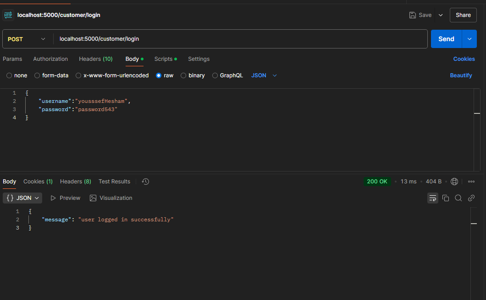
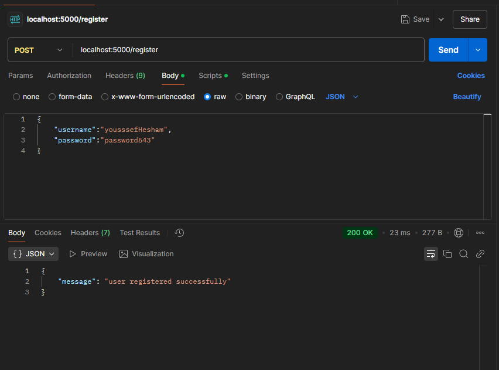
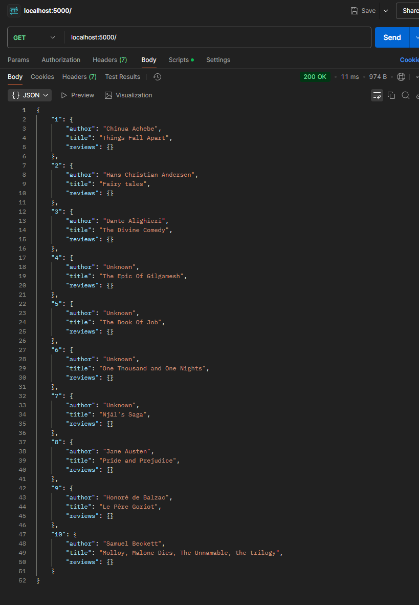
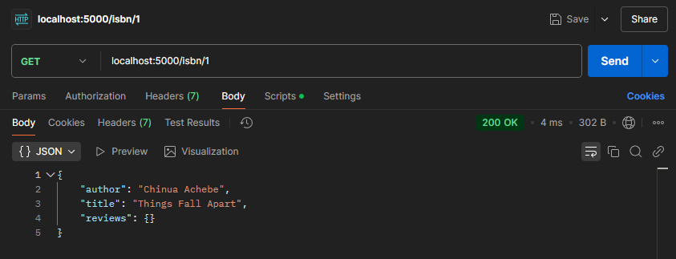
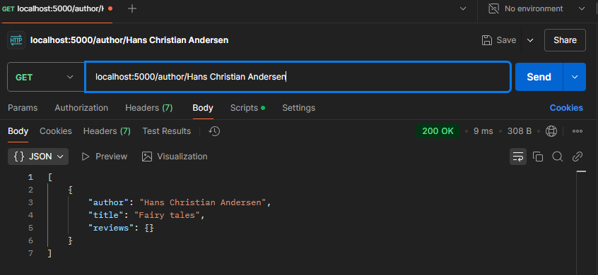
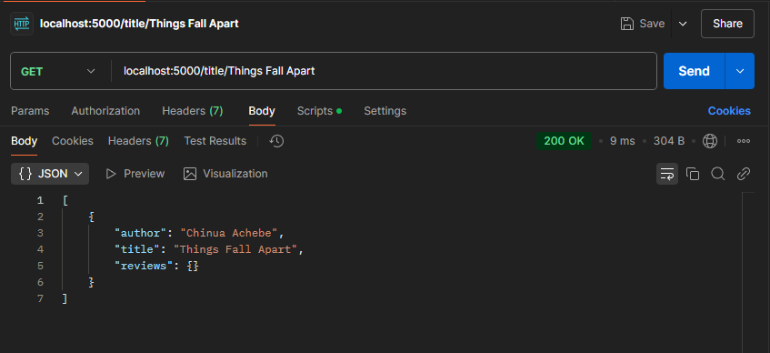
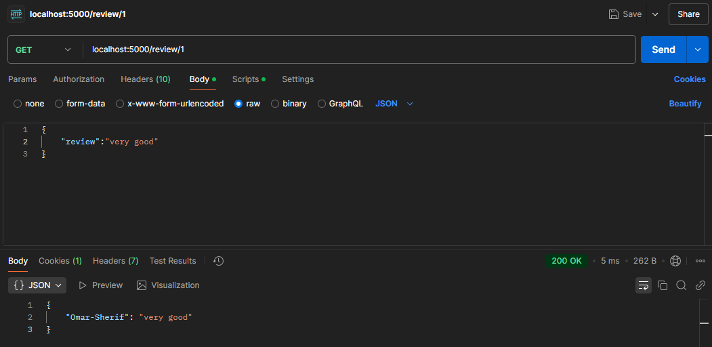
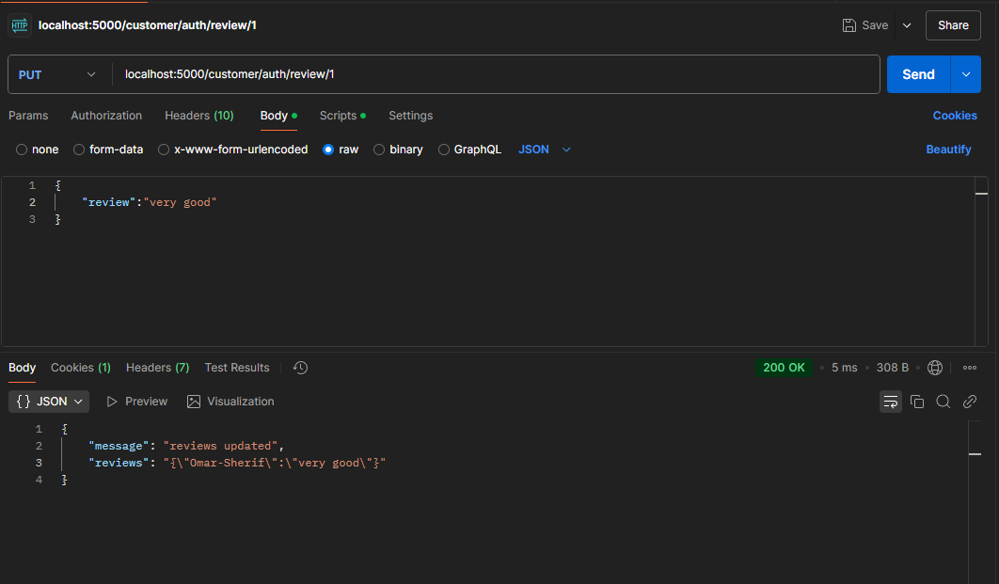
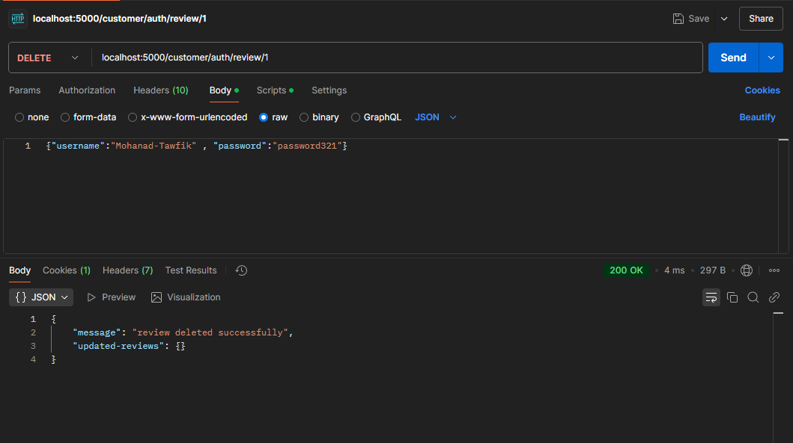

#  Bookshop RESTful API

This is the **server-side** implementation of a Bookshop web application built with **Node.js** and **Express.js**. It provides a RESTful API backend that allows users to view, search, review, and manage books and reviews.

---

##  Features

The application supports the following core features:

###  Books API
-  Retrieve all books in the bookshop
-  Search for books by:
  - ISBN
  - Author
  - Title
-  View reviews for any book

###  User Authentication
-  User Registration
-  User Login
-  JWT and Session-based authentication

###  Book Reviews 
-  Add a review (Logged-in users only)
-  Modify own review
-  Delete own review

###  Technologies Used
- RESTful web service built with **Express.js**
- **JWT & Sessions** for secure access control
- **Async/Await**, **Promises**, and **Callbacks** for efficient, non-blocking operations
- Supports concurrent access for multiple users

## Screenshots

Below are screenshots demonstrating various API functionalities tested using Postman.

| Feature               | Screenshot Preview                     |
|------------------------|----------------------------------------|
|  Login               |                   |
|  Registration        |     |
|  Get All Books       |     |
|  Get Book by ISBN    | |
|  Get Book by Author  | |
|  Get Book by Title   | |
|  View Book Reviews   |  |
|  Add a Review        |          |
|  Delete a Review     |    |

